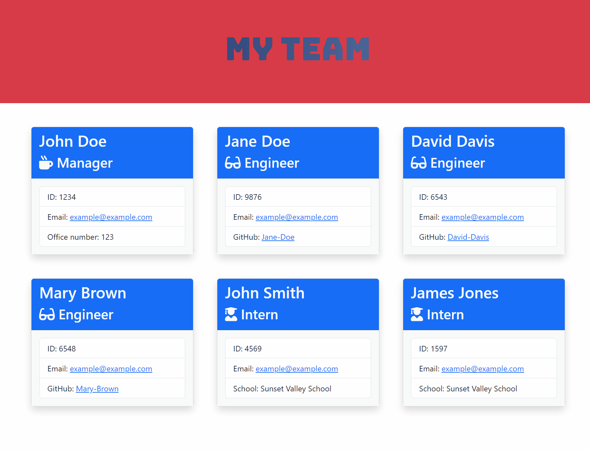

# Team-Profile-Generator

---

## Description

This command-line application is designed to dynamically generate an HTML webpage that displays summaries for each employee on a software engineering team. It caters to the needs of managers who require quick access to their team members' essential information such as email addresses and GitHub profiles. With a user-friendly interface, the application allows seamless input of data for the team manager, engineers, and interns, facilitating the generation of a comprehensive webpage.

## Project Overview

The project aims to simplify the process of creating a webpage to showcase team members' information for software engineering teams. By providing a streamlined command-line interface, managers can efficiently input data for each team member and generate an HTML webpage with minimal effort.

## Features

- Interactive command-line interface for user input.
- Ability to add team manager, engineers, and interns with their respective details.
- Automatic generation of an HTML webpage displaying summaries for each team member.
- Integration of Inquirer.js for collecting user input.
- Comprehensive unit tests using Jest to ensure code reliability.

## Installation

To install this application, simply clone the repository and run `npm install` to install the necessary dependencies.

## Usage

After installation, run the command `node index.js` to start the application. Follow the prompts to enter information about your team members. Once all prompts are completed, the application will generate an HTML file (team.html) and CSS file (style.css) in the output directory.

The following image demonstrates the appearance of the HTML file generated by the application.

## Technologies Used

- Node.js
- Inquirer.js
- JavaScript
- Jest
- HTML
- CSS
- Bootstrap 5

## Credits

This project was created by [NatVes](https://github.com/NatVes). It utilizes [Inquirer.js](https://www.npmjs.com/package//inquirer?activeTab=readme#answers) for user input and [Jest](https://jestjs.io/docs/getting-started) for testing. Special thanks to the [open-source community](https://stackoverflow.com/) for their valuable contributions and support.

## License

This project is licensed under the MIT license. 